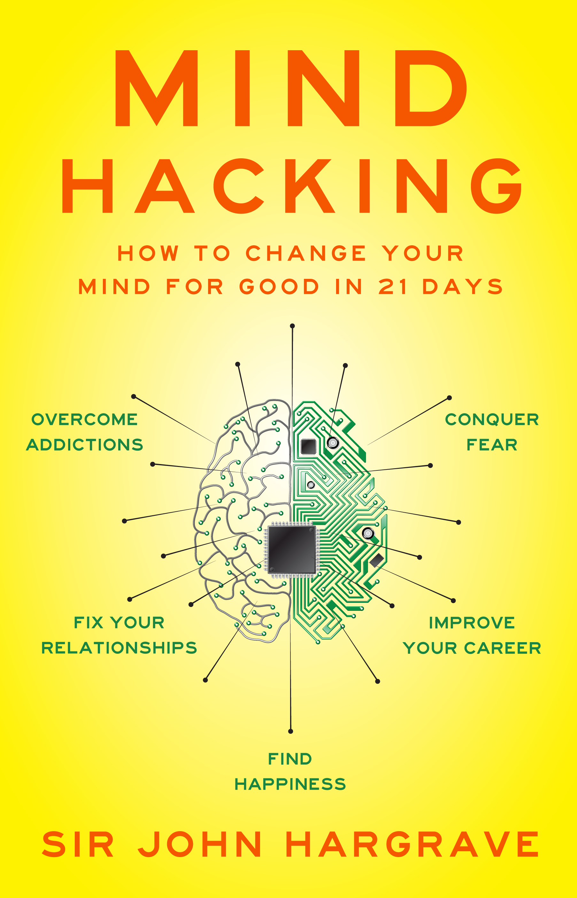

# Introduction

## JOIN THE MIND HACKING MOVEMENT. 

_Mind Hacking_ teaches you how to reprogram your thinking -- like reprogramming a computer -- to give you increased mental efficiency and happiness. The entire book is available here for free:  
[Click here to start reading _Mind Hacking_.](http://www.mindhacki.ng/content/my_story/index.html)

**Buy the book:** If you enjoy _Mind Hacking_, we hope you'll buy a copy for yourself or a friend. Now in its ninth printing, the book is available from Simon & Schuster's Gallery Books in print, Kindle, and Audible format:  
[Click here to order _Mind Hacking_ on Amazon.com.](http://www.amazon.com/Mind-Hacking-Change-Your-Good/dp/1501105655)

**Mind Hacking app**: The best way to become a mind hacker is to download the free app, which will guide you through the 21-day plan:  
[Click here to download the free _Mind Hacking_ app.](https://www.coach.me/plans/403192-mind-hacking-21-day-plan)

**Guided exercises and practice sheet**: Sign up below, and we'll send you a series of guided audio exercises \(read by the author!\) that will make you a master mind hacker, plus the 21-day Mind Hacking Practice Sheet!  
[Click here to get the free audio exercises and practice sheet.](http://www.bit.ly/mind-hacking-21-day-program)

Hack hard and prosper!

